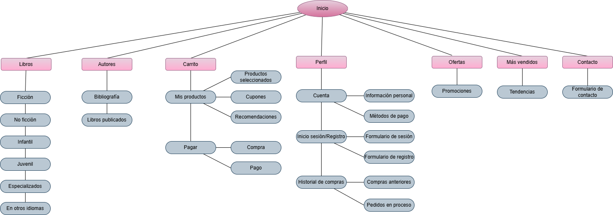

# 📚 Librosfera – Un mundo por leer

**Librosfera** es nuestra propuesta de e-commerce para el Proyecto #1 del curso *CI-0137 Aplicaciones Web*. Hasta este momento, *simula* una tienda digital que comprar libros.

---

## 🧩 Tecnologías utilizadas

- React JS 
- HTML
- CSS
- React Router DOM
- Open Library API (para pruebas con libros)
- Git y GitHub

---

## 🎨 Diseño e identidad visual

- Paleta de colores basada en tonos crema y dorado (`#fffbf0`, `#eab308`, `#333333`)
- Tipografía base: `"Trebuchet MS", "Segoe UI", Arial, sans-serif`
- Diseño responsive adaptado a dispositivos móviles y escritorio
- Logo minimalista original (incluido en `/public/images/logo`)

---

## 📌 Funcionalidades principales

- Registro de usuarios
- Inicio de sesión de usuarios
- Visualización de libros con portadas, autores y precios
- Carrito funcional con actualización de cantidades y totales
- Simulación de checkout

---

## 📈 Diagrama de diseño

El diseño considera:

---

## 🔐 Accesibilidad y usabilidad

- Navegación clara y semántica
- Botones y textos legibles
- Contraste adecuado en todos los elementos
- Compatible con teclado y lectores de pantalla

---

## 🚧 Recomendaciones de mejora futura

- Crear base de datos personalizada de libros
- Agregar filtros por género, autor y precio

---

## 🖥️ ¿Cómo ejecutar el proyecto localmente?

Asegúrate de tener instalado:

- Node.js

- npm (viene incluido con Node)

- Express

Y escribe lo siguiente en tu cmd:

1. git clone https://git.ucr.ac.cr/ERICK.HERNANDEZHERNANDEZ/desarrolloweb-2025.git

2. cd desarrolloweb-2025/librosfera

3. npm install (para instalar dependencias)

4. cd ../backend

5. node index.js

6. En otra terminal, ubicarse en cd librosfera/src

6. npm start
